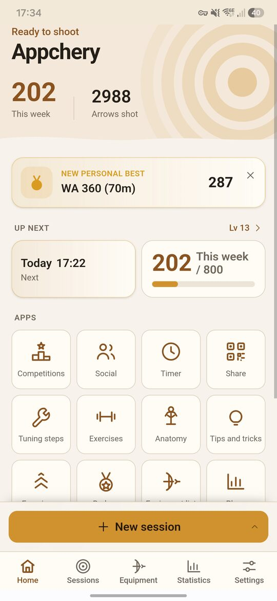
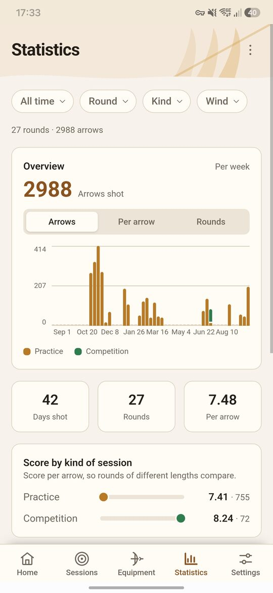
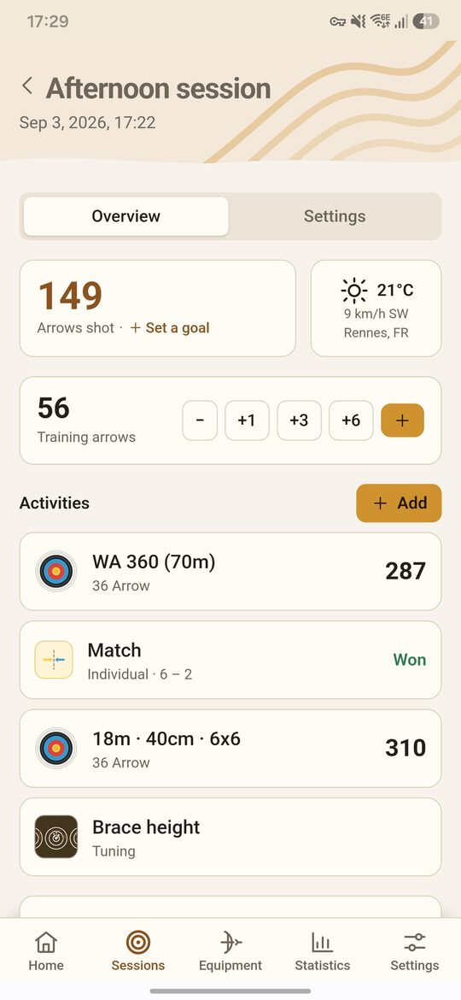
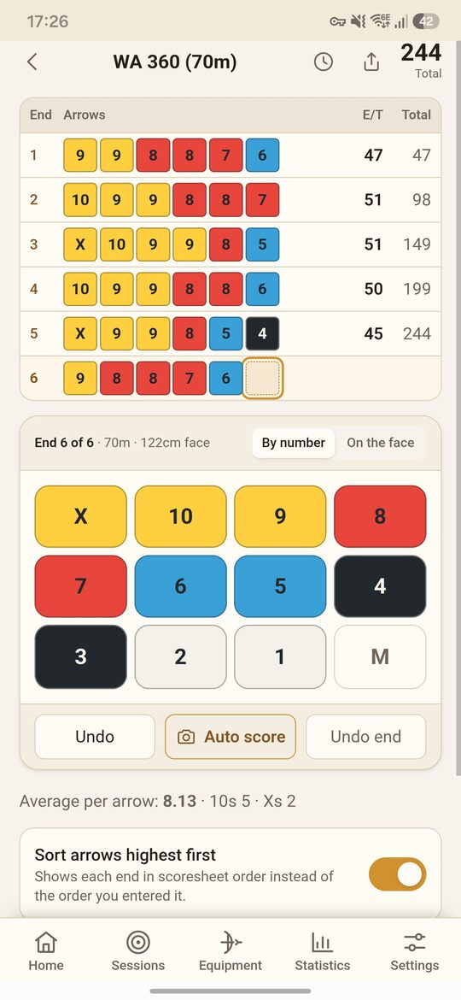
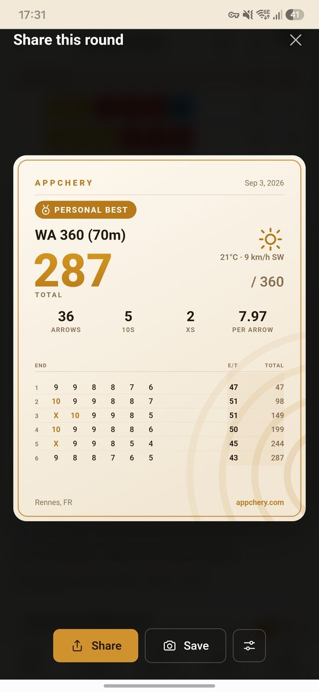
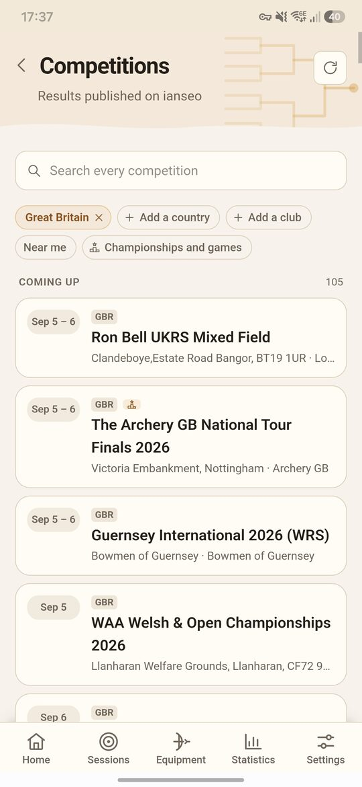

# Appchery

**Archery Scoring & Training**  
Offline, on your phone or in a browser.

### → [appchery.com](https://appchery.com)

Score a round, tune your bow, count your arrows, train for the shot. Appchery keeps it all on your phone, and works with no signal at all.

<table>
  <tr>
    <td width="33%"></td>
    <td width="33%"></td>
    <td width="33%"></td>
  </tr>
  <tr>
    <td align="center"><b>Home</b><br>Weekly goal, levels, everything one tap away</td>
    <td align="center"><b>Statistics</b><br>Per arrow, per round, per conditions</td>
    <td align="center"><b>Sessions</b><br>Rounds, matches and tuning in one outing</td>
  </tr>
  <tr>
    <td></td>
    <td></td>
    <td></td>
  </tr>
  <tr>
    <td align="center"><b>Scoring</b><br>By number or on the face, every arrow editable</td>
    <td align="center"><b>Share</b><br>A score card worth posting</td>
    <td align="center"><b>Competitions</b><br>Every ianseo event, kept for offline reading</td>
  </tr>
</table>

Design and rationale live in [doc/architecture.md](doc/architecture.md) and
[doc/data-model.md](doc/data-model.md). Read those before making structural changes. Shipping is
[doc/deploy.md](doc/deploy.md); schema changes are [doc/migration.md](doc/migration.md); reading
competition results is [doc/ianseo.md](doc/ianseo.md).

## Stack

SvelteKit (SPA, `adapter-static`) + Capacitor for iOS/Android, with SQLite as the local source of
truth — WASM/OPFS in the browser, native SQLite on device — accessed through Drizzle.

## Getting started

```bash
npm install
./scripts/dev.sh     # dev server with hot reload, exposed on the LAN
./scripts/run.sh     # build and serve the production bundle
npm test             # domain and scoring unit tests
```

`dev.sh` and `run.sh` both bind to the LAN, so the same server opens on a phone. Set `PORT` to
change the port.

### Deploying the web build

The browser build **must be served with these two headers**:

```
Cross-Origin-Opener-Policy: same-origin
Cross-Origin-Embedder-Policy: require-corp
```

Without them the page is not cross-origin isolated, SQLite cannot use OPFS, and the app falls back
to an in-memory database that loses everything on reload. It degrades loudly rather than silently —
a banner appears and Settings shows the active storage mode — but it is not a usable deployment.
The dev and preview servers set these via a plugin in `vite.config.ts`; production is your host's
configuration (`_headers`, nginx, Cloudflare rule).

Native builds are unaffected: they use platform SQLite, not OPFS.

#### Cloudflare Pages

`static/_headers` carries those headers and `static/_redirects` routes unknown paths back to the
SPA shell; both are copied into `build/` and read by Pages from the deployment root. GitHub Pages is
not an option here — it serves fixed headers, so the app would run without OPFS.

```bash
npm run deploy:preprod   # → appchery-preprod
npm run deploy:prod      # → appchery, asks for confirmation
./scripts/deploy.sh preprod --dry-run
```

Environments, first time setup, the database side, and the release order live in
[doc/deploy.md](doc/deploy.md). Schema changes on either database are in
[doc/migration.md](doc/migration.md).

### Installing on a phone

```bash
./scripts/adb_install.sh   # build, sync, assemble the debug APK, install over adb
./scripts/build_apk.sh     # the same, stopping at the APK — no device needed
```

Both expect an SDK at `$ANDROID_HOME` (defaulting to `~/Android/Sdk`) with platform 36 and
build-tools 36, and a JDK Gradle supports; `adb_install.sh` also wants a device with USB debugging
enabled. Set `JAVA_HOME` if 21 is not where the scripts look, `APPCHERY_ANDROID_HOME` to force a particular
SDK, and — for `build_apk.sh` — `APPCHERY_JAVA_HOME` to force a particular JDK.

`build_apk.sh` checks everything it needs before it starts and lists whatever is missing in one go,
then prints the path it wrote. The APK it produces is debug-signed rather than release-signed:
installable by hand or over adb, not something to publish.

iOS needs Xcode:

```bash
npx cap add ios
npm run cap:sync
npx cap open ios
```

### Installing as a web app

The build ships a manifest and a service worker that precaches the whole app, so it installs from
the browser and runs with no network. Installation needs HTTPS: a plain LAN address will run the
app but will not offer to install it.

## Project layout

```
src/lib/domain/         pure scoring, round, tuning and unit logic, no I/O, fully unit-tested
src/lib/db/             schema, bundled migrations, platform drivers, repository
src/lib/pages/          the screens, one Svelte component each
src/lib/ui/             shared components
src/lib/i18n/           en (reference) and fr dictionaries
src/lib/vision/         camera scoring: face detection, arrow impacts, worker and model
src/lib/sync/           optional account sync and shared score cards
src/lib/ianseo/         competition listings, results and brackets from ianseo
src/lib/competitions/   competition dates, distances and links, independent of the source
src/lib/ffta/           French federation listings
src/lib/inscriptarc/    inscriptarc entry lists
src/lib/import/         importing scores from other apps
src/lib/pdf/            PDF text extraction for published result sheets
src/routes/             thin SvelteKit routes over src/lib/pages
site/                   the marketing site, built separately (vite.site.config.ts)
functions/              Cloudflare Pages functions (competitions API)
supabase/               sync database schema, migrations and tests
test/                   fixtures and datasets for the parsers and for vision
doc/                    architecture, data model, development guidelines
```

The `domain/` layer imports nothing from the database or the UI. Scoring rules are the part that
must not be wrong, so they stay testable without a browser or a device.

## Contributing

Three things to know before opening a PR:

1. **Scoring data is rules data.** Round definitions and zone maps must be verified against the
   current published rulebook of the governing body concerned. Field, IFAA, IBO and ASA score sets
   ship flagged as unverified and the app warns on them: see
   [doc/scoring-verification.md](doc/scoring-verification.md) for what must be checked before a flag
   is removed.
2. **Read [doc/dev_guidelines.md](doc/dev_guidelines.md)** for commit, comment, and prose rules.
3. **English is the reference locale.** Add keys to `src/lib/i18n/en.ts` first; other locales are
   type-checked against it, so the build fails until each one is translated.

Contributions require signing a CLA — see below.

## Licence

[AGPL-3.0-only](LICENSE), plus a Contributor License Agreement.

AGPL keeps modifications open, including for anyone running this as a hosted service. The CLA keeps
the option of a future commercial offering open for the project owner. If you would rather not sign
a CLA, that is a legitimate position — please say so in your issue or PR and we can discuss.
